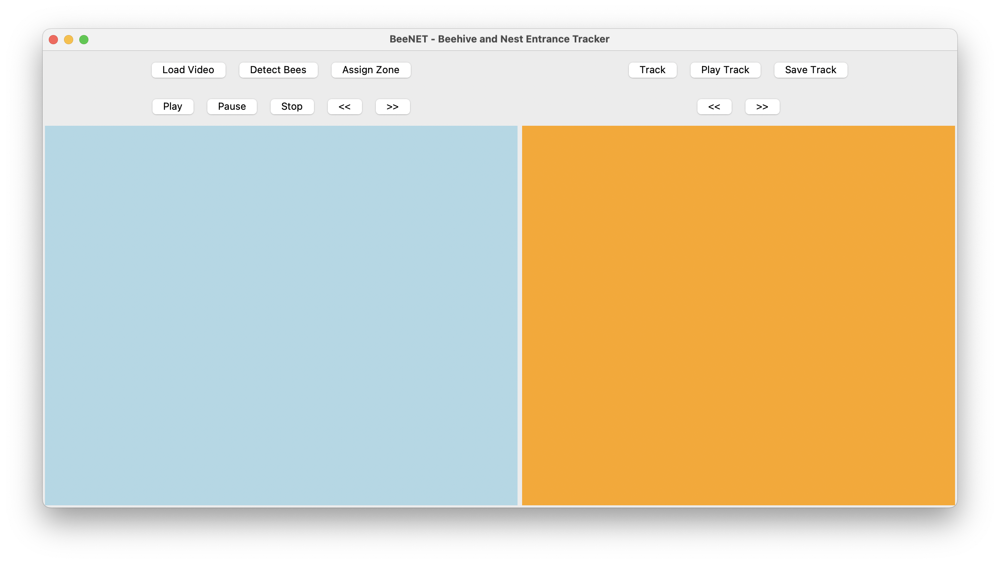
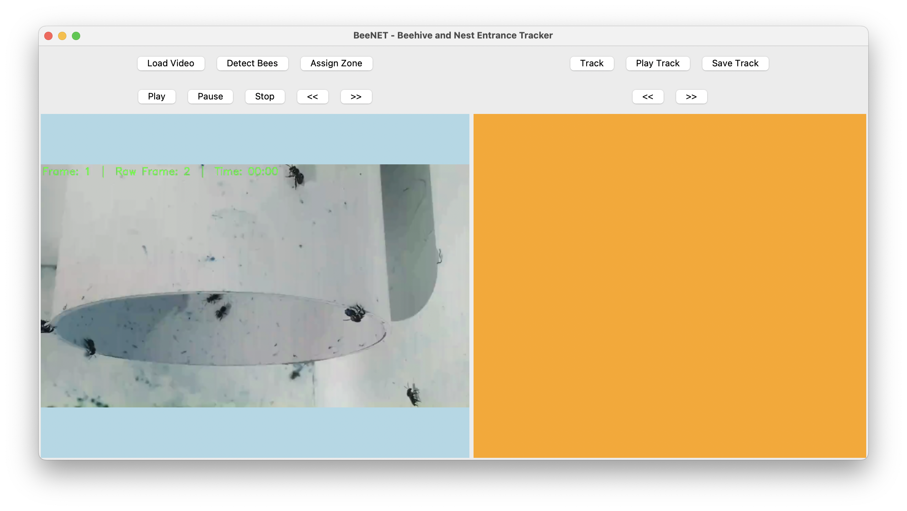
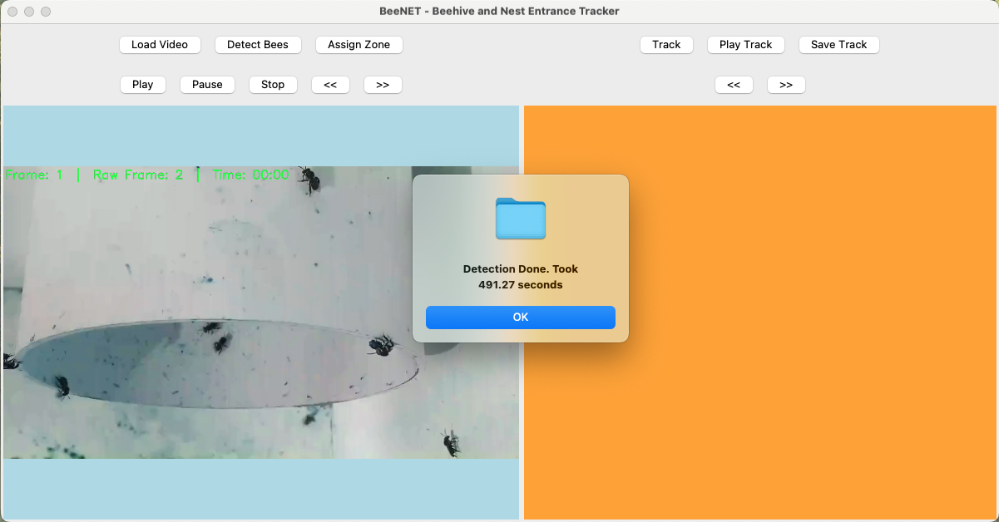
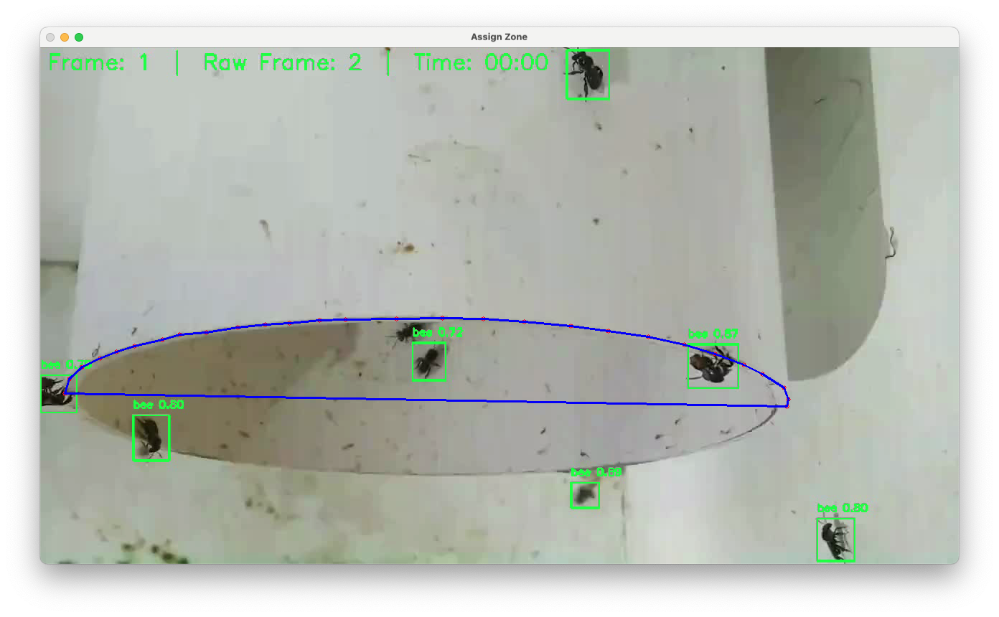
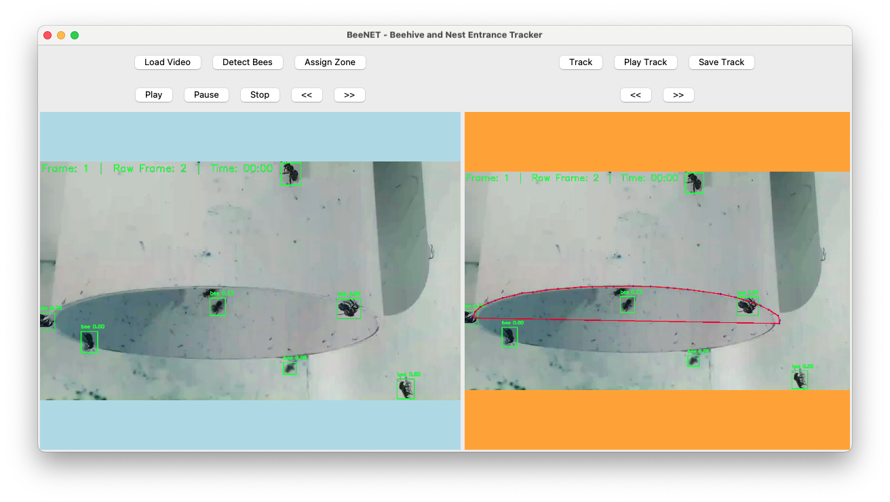
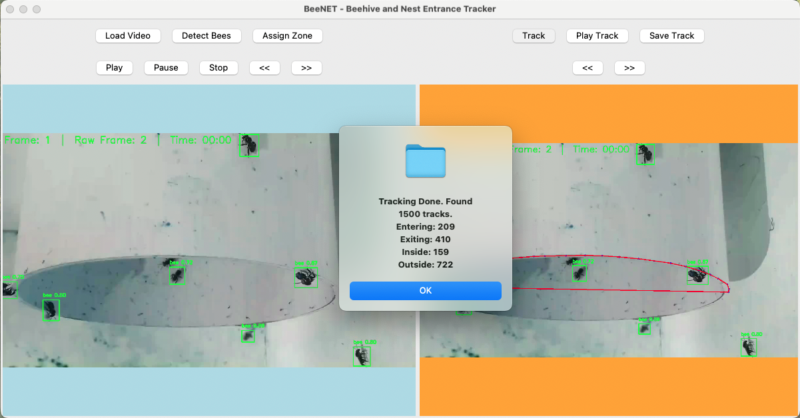
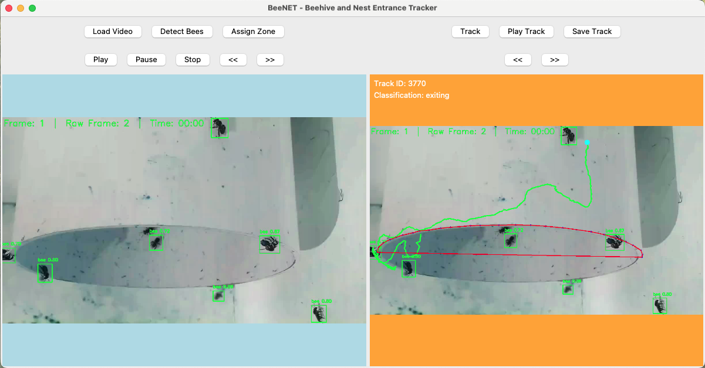
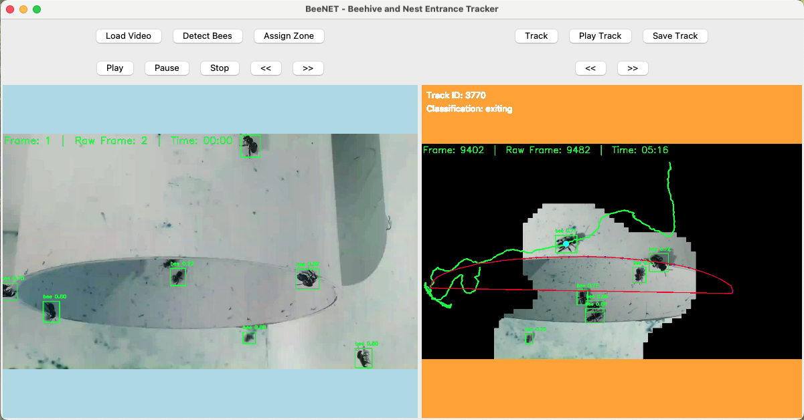
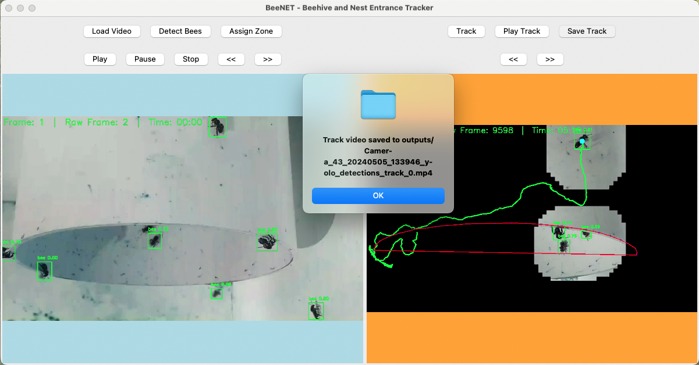

# BeeTrackingGUI


## Overview

**BeeTrackingGUI** is a Python-based graphical user interface (GUI) designed for tracking bees in video footage. This tool integrates bee detection, Kalman filter-based tracking, and user interaction for zone assignment and real-time monitoring. The system is tailored for researchers and enthusiasts working with bee tracking data, providing an intuitive interface to manage and analyze bee movement.

## Features

- **Video Playback Control**: Load, play, pause, and stop video files to review bee tracking footage.
- **Bee Detection**: Integrated YOLO-based detector (`bee_detector_yolo.py`) for identifying bees in video frames.
- **Tracking with Kalman Filter**: Utilizes a Kalman filter (`kalman_tracker.py`) to track the movement of bees over time.
- **Zone Assignment**: Assign specific zones within the video frame to analyze bee activity in predefined areas.
- **Real-Time Statistics**: Display tracking statistics such as the number of bees that have entered, exited, or remained inside designated zones.

## Installation

### Prerequisites

Ensure you have Python 3.x installed on your system. You will also need the following Python libraries:

- `opencv-python`
- `ultralytics` (for YOLO)
- `matplotlib`
- `numpy`
- `tkinter`
- `pandas`
- `scikit-learn`
- `filterpy` (for Kalman filter)

You can install these dependencies via pip:

```bash
pip install opencv-python matplotlib numpy tkinter pandas scikit-learn filterpy ultralytics
```

### Cloning the Repository

Clone the repository using the following command:

```bash
git clone https://github.com/YourUsername/BeeTrackingGUI.git
cd BeeTrackingGUI
```

## Usage

Run the main GUI application:

```bash
python bee_tracker_gui.py
```

### Files Description

- **bee_tracker_gui.py**: The main GUI application file. This file handles the user interface and integrates all components of the system.
- **kalman_tracker.py**: Implements the Kalman filter used for tracking bees across video frames.
- **bee_detector_yolo.py**: Contains the YOLO-based detection algorithm for identifying bees in video footage.

## Example

Below is an example of how to use the BeeTrackingGUI:

1. Load your video file by clicking the "Load Video" button.
2. Click on the "Detect Bees" button to identify bees in the video frames. It uses the YOLO detector to locate bees in each frames. Therefore, depending on the video length, it may take some time to process. It will automatically create a CSV file with the detected bee information along with a new video file with bounding boxes around the detected bees. Next time you load the same video, it will use the CSV file to load the detected bee information instead of running the detection again.
3. Once the detection is complete, you can assign zones by clicking the "Assign Zone" button. This allows you to define specific areas within the video frame for analysis.
4. Start the bee tracking process by clicking the "Track Bees" button. The system will use the Kalman filter to track the movement of bees over time. After tracking is complete, a summary of the bee activity will be displayed.
5. You can select different tracks using the "<<" and ">>" buttons to view the tracking results for each bee individually.
6. You can use "Show Track Video" button to visualise the bee tracking in the video.
7. You can use "Save Track Video" button to save the video with tracking information.

## Screenshots

Here are some screenshots of the BeeTrackingGUI:

### Main Interface of the BeeTrackingGUI



### Load Video Interface



### Detect Bees using YOLO-v8



### Detected Bees Result



### Assign Zone Interface



### Track Bees Interface



### Track Bees Result



### Show Track Video Interface



### Save Track Video Interface



## Contributing

Contributions are welcome! Please fork the repository, create a new branch, and submit a pull request for any features or improvements.

## License

This project is licensed under the GPL-3.0 license. See the [LICENSE](LICENSE) file for more details.

## Contact

For any questions or suggestions, feel free to reach out via GitHub issues or email [asaduzzaman@monash.edu].
